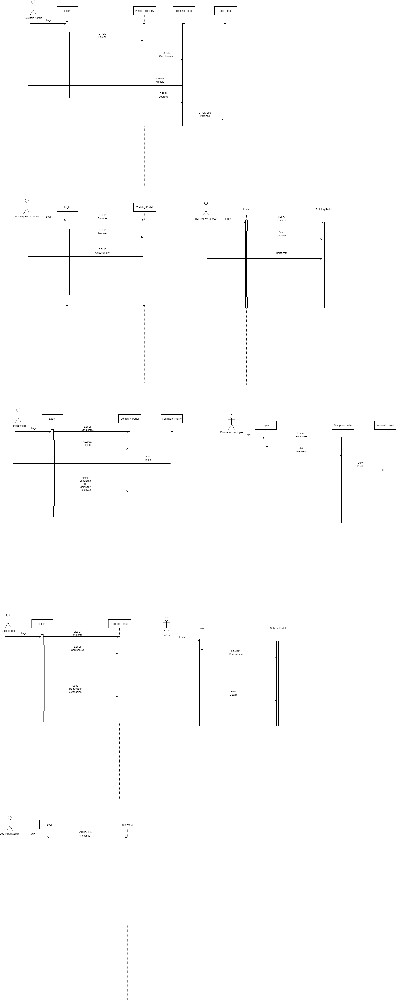

# AED_Final_Project

## About the project

Job portal is an application which connects employer and job seekers where employers are the source of the resources, and the job seeker can find and apply for their targeted job. It even connects College HR department with the companies and allow then to request companies. It has a training portal which enables student to take up training and receive certificates which enhancers their profiles.

### Enterprises Structure

 - Enterprise 1: Company
    - Organization 1: HR
        - Role: Recruiter
    - Organization 2: Tech Team
        - Roles: Team Lead, Manager
    - Organization 3: System Administrators
        - Roles: Company System admin
 - Enterprise 2: Job Portal
    - Organization 1: Jobs management
        - Roles: User, Job Poster, Site Administrator
 - Enterprise 3: College
    - Organization 1: College HR
        - Role: Company Relationships Manager
    - Organization 2: Student Organization
        - Role: Student
 - Enterprise 4: Training Sites (like geeksforgeeks)
    - Organization 1: Training course Management
        - Roles: Trainee, Site Administrator

## Group Members

- Sharun Kumar Kakkad Sasikumar	002774079
- Apoorva Jain	            	002764526
- Mihir Sheth		                002743969

## Class Diagram:

Lucid Chart Link: https://lucid.app/lucidchart/2c1aba1f-f6c1-4f5f-a2d8-bee2359d955e/edit?viewport_loc=-11%2C-11%2C2219%2C1055%2CiONdaG-N9HQX&invitationId=inv_693d30b0-454f-4d68-a36c-b8f73d23e4e1

## Sequence Diagrams:

Lucid Chart Link: https://lucid.app/lucidchart/2c1aba1f-f6c1-4f5f-a2d8-bee2359d955e/edit?viewport_loc=-11%2C-11%2C2219%2C1055%2CoONdrMwrldWl&invitationId=inv_693d30b0-454f-4d68-a36c-b8f73d23e4e1

